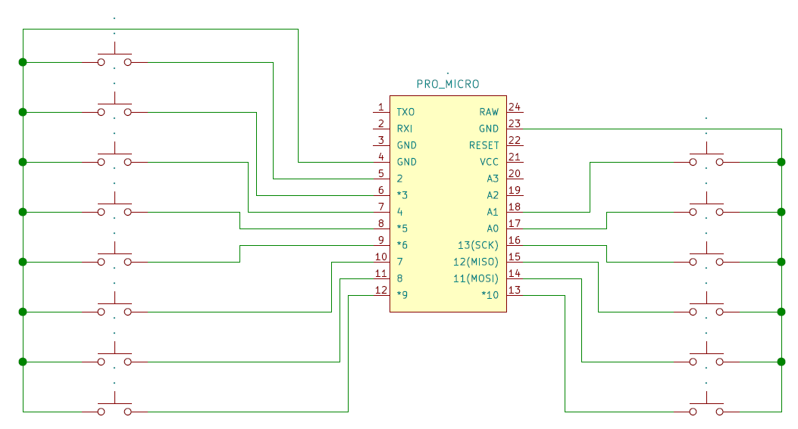
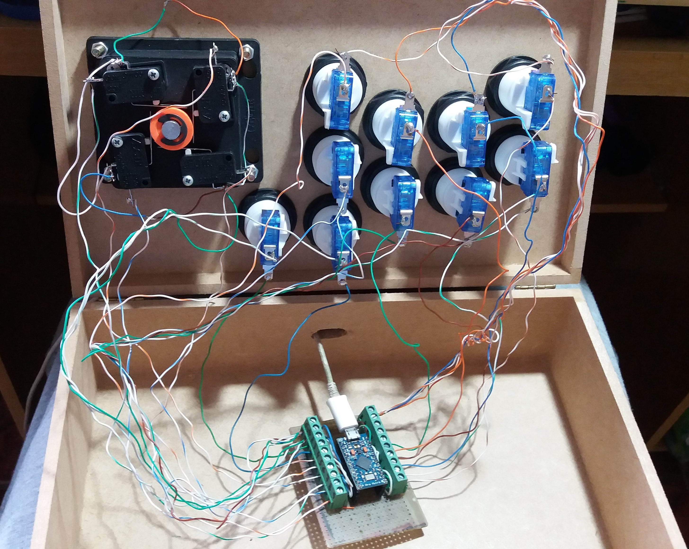
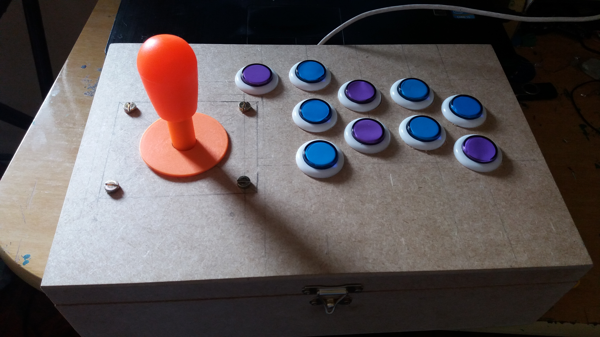

# Gamepad utilizando Arduino Pro Micro

O projeto visa a montagem de um joystick no estilo arcade, com botões e comando.

<h3>Materiais</h3>

- Arduino Pro Micro
- Botões
- Comando
- Caixa de mdf 20x30x9

<h3>Esquemático</h3>



Como é possível notar, trate-se apenas de vários botões ligados às entradas e ground do Arduino Pro Micro: 


<h3>Montagem do Hardware</h3>

Para facilitar as conexões entre botões e Arduino, foi montado um adaptador entre as GPIO, VCC e GND para bornes:


Os botões são ligados a micro switches. Como não possuo os cabos recomendados, soldei um fio em cada terminal dos micro switches. A outra ponta dos cabos foi colocada nos bornes:


É, não ficou bonito. Pretendo unir os GNDs dos micro switches para diminuir a quantidade de fios.

A ordem de ligação das GPIO de pouco importa, pois a configuração dos comandos é feita nos próprios emuladores.

O lado de fora:



Futuramente enveloparei a parte de cima da caixa, pintarei as laterais e parte inferior e possivelmente incluirei LEDs nos botões.

<h3>Software</h3>

A biblioteca Gamepad atendeu muito bem às necessidades do Joystick:

```c
#include <Gamepad.h>

//Initializing a Gamepad
Gamepad gp;
void setup() {
  //initializing inputs
 
  pinMode(2,  INPUT_PULLUP);
  pinMode(3,  INPUT_PULLUP);
  pinMode(4,  INPUT_PULLUP);
  pinMode(5,  INPUT_PULLUP);
  pinMode(6,  INPUT_PULLUP);
  pinMode(7,  INPUT_PULLUP);
  pinMode(8,  INPUT_PULLUP);
  pinMode(9,  INPUT_PULLUP);
  pinMode(10,  INPUT_PULLUP);
  pinMode(16,  INPUT_PULLUP);
  pinMode(14,  INPUT_PULLUP);
  pinMode(15,  INPUT_PULLUP);
  pinMode(A0,  INPUT_PULLUP);
  pinMode(A1,  INPUT_PULLUP);
  
}

void loop() {
 
  
  int pin2;
  pin2 = digitalRead(2);
  if(pin2 == LOW)
    gp.setButtonState(0, true);
  else
    gp.setButtonState(0, false);

  int pino3;
  pino3 = digitalRead(3);
  if(pino3 == LOW)
    gp.setButtonState(1, true);
  else
    gp.setButtonState(1, false);
    
  int pino4;
  pino4 = digitalRead(4);
  if(pino4 == LOW)
    gp.setButtonState(2, true);
  else
    gp.setButtonState(2, false);

  int pino5;
  pino5 = digitalRead(5);
  if(pino5 == LOW)
    gp.setButtonState(3, true);
  else
    gp.setButtonState(3, false);

  int pino6;
  pino6 = digitalRead(6);
  if(pino6 == LOW)
    gp.setButtonState(4, true);
  else
    gp.setButtonState(4, false);

  int pino7;
  pino7 = digitalRead(7);
  if(pino7 == LOW)
    gp.setButtonState(5, true);
  else
    gp.setButtonState(5, false);

  int pino8;
  pino8 = digitalRead(8);
  if(pino8 == LOW)
    gp.setButtonState(6, true);
  else
    gp.setButtonState(6, false);

  int pino9;
  pino9 = digitalRead(9);
  if(pino9 == LOW)
    gp.setButtonState(7, true);
  else
    gp.setButtonState(7, false);

  int pino10;
  pino10 = digitalRead(10);
  if(pino10 == LOW)
    gp.setButtonState(8, true);
  else
    gp.setButtonState(8, false);

  int pino16;
  pino16 = digitalRead(16);
  if(pino16 == LOW)
    gp.setButtonState(9, true);
  else
    gp.setButtonState(9, false);

  int pino14;
  pino14 = digitalRead(14);
  if(pino14 == LOW)
    gp.setButtonState(10, true);
  else
    gp.setButtonState(10, false);

  int pino15;
  pino15 = digitalRead(15);
  if(pino15 == LOW)
    gp.setButtonState(11, true);
  else
    gp.setButtonState(11, false);

  int pinoA0;
  pinoA0 = digitalRead(A0);
  if(pinoA0 == LOW)
    gp.setButtonState(12, true);
  else
    gp.setButtonState(12, false);

  int pinoA1;
  pinoA1 = digitalRead(A1);
  if(pinoA1 == LOW)
    gp.setButtonState(13, true);
  else
    gp.setButtonState(13, false);

  delay(20);
}
```


<h3>Teste</h3>

O resultado pode ser visto [aqui](https://youtu.be/RrjQ3o1sHnY).

<h3>Referências</h3>
</br>

https://www.instructables.com/id/Arduino-LeonardoMicroATMega32u4-As-GamepadGame-Con/</br>
https://github.com/gamelaster
