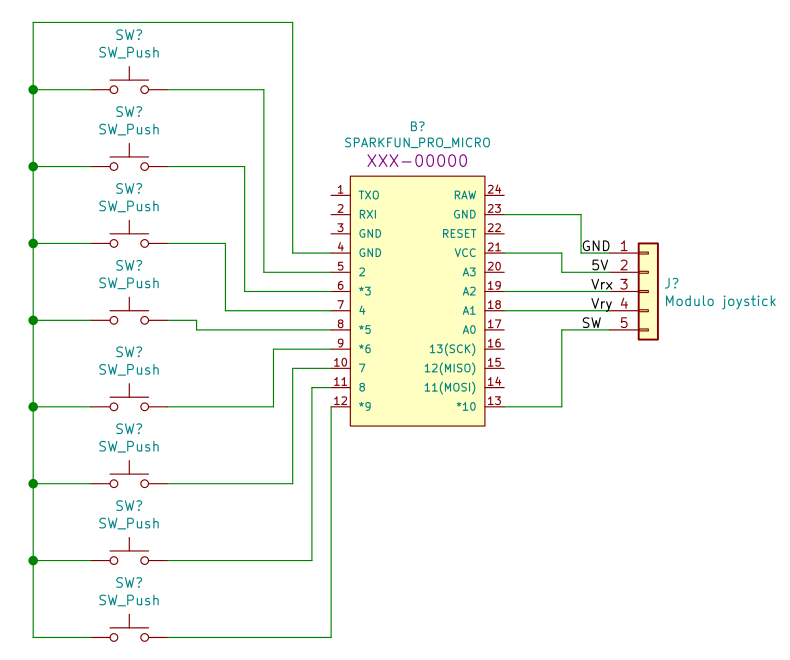

# Gamepad utilizando Arduino Pro Micro

O projeto visa a montagem de um simples controle arcade, com manete e botões.

<h3>Materiais</h3>

- Arduino Pro Micro
- Push buttons
- Analógico de Playstation 2
- Barras de pinos

<h3>Esquemático</h3>

Como é possível notar, trate-se apenas de vários botões e um módulo analógico conectados ao Arduino Pro Micro: 

<h3>Placa</h3>

Por falta de materiais adequados, utilizei push buttons ao invés de botões próprios para arcade e um analógico de Playstation 2 soldado em uma placa de fenolite no lugar da manete. A ordem dos pinos desse último não está idêntica ao apresentado em módulos joystick vendidos na internet, mas alterar a ordem de ligação com o Arduino resolve a situação facilmente.

A soldagem dos botões e barras de pinos foi feita em uma placa ilhada.

O módulo joystick foi encaixado em uma barra de pinos, pois pretendo utilizá-lo em futuros projetos, não sendo conveniente mantê-lo soldado em uma placa.

<h3>Teste</h3>
